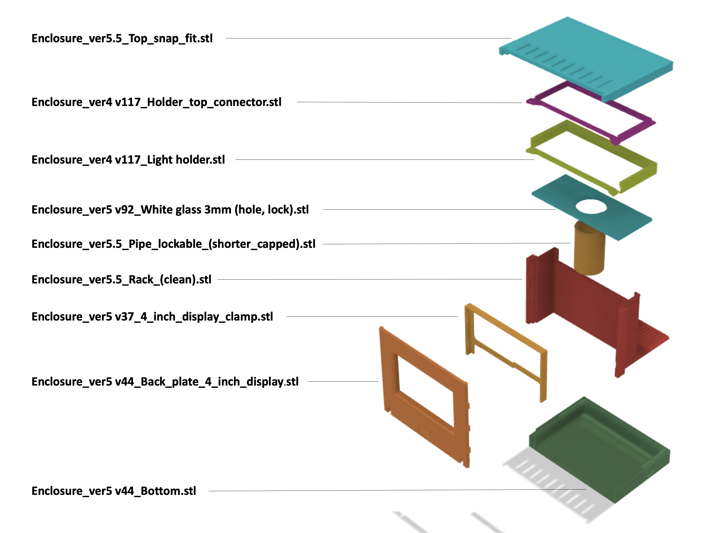

# RasQberry_enclosure
Enclosure for the RasQberry project. Replicates the look of the IBM Q System One.

### STL files "RasQberry-One"
The latest version of STL files (as of 08/2024) are in the folder [STL/RasQberry-One](STL/RasQberry-One).

* [01-universal-parts](STL/RasQberry-One/01-universal-parts) need to printed in any case.
* [02-model-only](STL/RasQberry-One/02-model-only) are needed for the pure 3D model.
* [03-raspberry-housing](STL/RasQberry-One/03-raspberry-housing) can be used as a housing for a Raspberry Pi model 4.

We will shortly upload a scaled (30% larger) version that allows LEDs and buttons to be added.

### STL files for Version 5.5
This is a mapping of the STL files necessary for printig all parts for version 5: 

*Please note that v5.5 is outdated. The image is kept for illustrative purposes.*

### Assembly for Version 5.5
 

